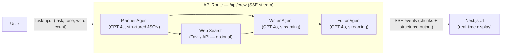

# SEO Content Crew — Presentation

---

## Slide 1 — Title

# SEO Content Crew

> A coordinated multi-agent AI system that plans, writes, and edits SEO-optimized content — autonomously.

| Layer | Technology |
|---|---|
| Framework | Next.js 16 (App Router) |
| Language | TypeScript (strict) |
| LLM | OpenAI GPT-4o |
| Search | Tavily Web Search API |
| Transport | Server-Sent Events (SSE) |
| Styling | Tailwind CSS |

---

## Slide 2 — Problem Statement

### Why does this exist?

Creating SEO content manually is:

- **Slow** — research, outlining, writing, and editing are separate multi-hour tasks
- **Inconsistent** — different writers produce different quality and keyword coverage
- **Hard to scale** — one person cannot maintain a structured, keyword-driven content pipeline
- **Error-prone** — SEO strategy often gets lost between planning and final copy

Existing AI tools generate "one-shot" content — a single LLM call with no structured thinking, no research step, and no editorial pass.

**The gap:** no separation of concerns between strategy, writing, and quality control.

---

## Slide 3 — Solution Overview

### What SEO Content Crew does

The user provides a single task description. Three specialized agents then execute a structured pipeline:

1. The **Planner** thinks strategically — defines the outline, keywords, audience, and research needs
2. The **Writer** executes the plan — produces a full draft following the blueprint exactly
3. The **Editor** refines the output — improves clarity, SEO density, flow, and formatting

The result is a production-ready, SEO-optimized article delivered in real time, with full transparency into every agent's reasoning.

No agent overlaps another's role. No agent can override another's decisions.

---

## Slide 4 — Multi-Agent Architecture

### System Architecture



**Execution is strictly sequential:** Planner → Search → Writer → Editor.
Each agent receives the previous agent's output as its input — no agent works in isolation.

---

## Slide 5 — Agent Roles

### The Three Agents

#### Planner Agent
- **Responsibility:** Strategic architect. Breaks the task into a structured JSON plan — objective, content outline, primary/secondary SEO keywords, search queries, and handoff instructions for the Writer.
- **Tools allowed:** LLM reasoning, Web Search (query generation only)
- **Not allowed:** Writing prose, editing copy, changing strategy mid-flight

#### Writer Agent
- **Responsibility:** Content producer. Expands the Planner's outline into a full markdown draft. Integrates keywords naturally. Maintains the specified tone and word count.
- **Tools allowed:** LLM, Planner output, search results
- **Not allowed:** Changing the structure, redefining the objective, SEO strategy decisions

#### Editor Agent
- **Responsibility:** Quality controller. Improves clarity, removes redundancy, strengthens headings, enhances SEO density naturally, fixes logical flow, and returns a structured list of every improvement made.
- **Tools allowed:** LLM, SEO optimization rules
- **Not allowed:** Rewriting from scratch, changing strategic direction

---

## Slide 6 — Tech Stack

### Technology Choices

| Component | Choice | Reason |
|---|---|---|
| **Framework** | Next.js 16 App Router | Server-side streaming, API routes, file-based routing |
| **LLM** | GPT-4o via OpenAI SDK | High instruction-following accuracy for structured JSON + long-form content |
| **Search** | Tavily API | Purpose-built for LLM-augmented research; clean JSON output |
| **Streaming** | Server-Sent Events (SSE) | Unidirectional server-to-client; no WebSocket overhead needed |
| **State** | React `useRef` + `useState` | Refs accumulate streaming chunks without triggering excess re-renders |
| **Types** | TypeScript strict mode | Enforced contracts between agents via shared interfaces |

**Search is optional** — if `TAVILY_API_KEY` is absent, the system falls back to mock results so the pipeline never breaks.

---

## Slide 7 — Data Flow

### How data moves through the system

```
TaskInput
  │  task, targetAudience, wordCount, tone, enableSearch
  ▼
PlannerOutput (JSON)
  │  objective, contentStructure[], seoKeywords{}, handoffInstructions, searchQueries[]
  ▼
SearchResult[] (optional)
  │  title, url, snippet  — injected into Writer context
  ▼
WriterOutput
  │  content (markdown string), wordCount
  ▼
EditorOutput
  │  revisedContent (markdown), improvements[], finalWordCount
```

All contracts are defined in [`src/types/index.ts`](src/types/index.ts). The Planner returns strict JSON — if parsing fails, the orchestrator surfaces an error event over SSE before the Writer is invoked.

The handoff is **one-way and immutable**: each agent receives the upstream output as read-only context and cannot modify it.

---

## Slide 8 — Real-Time Streaming

### How the live UI works

The orchestrator at [`src/app/api/crew/route.ts`](src/app/api/crew/route.ts) opens a single SSE stream for the entire pipeline. Events are emitted at each stage transition:

| Event | When fired | Payload |
|---|---|---|
| `planner:start` | Planner begins | — |
| `planner:thinking` | Planner JSON parsed | `PlannerOutput` |
| `planner:search` | Search queries dispatched | `string[]` |
| `planner:complete` | Plan + search results ready | `{ plannerOutput, searchResults }` |
| `writer:start` | Writer begins | — |
| `writer:chunk` | Each token streamed | `string` |
| `writer:complete` | Draft finalized | `{ content, wordCount }` |
| `editor:start` | Editor begins | — |
| `editor:chunk` | Each token streamed | `string` |
| `editor:complete` | Edit pass done | `EditorOutput` |
| `crew:complete` | Full result | `CrewResult` |
| `crew:error` | Any failure | `string` |

The UI reads the stream in a `ReadableStream` loop, dispatches each event to a local state handler, and renders agent panels progressively — users see content appear token by token.

---

## Slide 9 — Key Design Decisions

### What makes this system robust

**1. Strict Role Separation**
Each agent's system prompt explicitly lists what it is *not allowed* to do. The Planner cannot write prose. The Writer cannot change the outline. The Editor cannot rewrite from scratch. This prevents role collapse — a common failure mode in single-prompt LLM pipelines.

**2. Structured JSON Handoff from Planner**
The Planner returns a typed JSON object (`PlannerOutput`), not free text. This ensures the Writer and Editor always receive a machine-readable, predictable contract — never an ambiguous paragraph.

**3. Graceful Search Fallback**
If the Tavily API key is missing or a search query fails, the system silently uses mock results and continues. The pipeline never hard-fails due to a missing optional dependency.

**4. SSE Over WebSockets**
Server-Sent Events are unidirectional and HTTP-native — no handshake overhead, no connection management, no reconnect logic needed for this use case. Each agent's token stream is pushed directly to the client as it is generated.

**5. Ref-Based Chunk Accumulation**
Writer and Editor content is accumulated in `useRef` (not `useState`) during streaming to avoid re-render thrashing. State is updated alongside for display, but the accumulated string is always in the ref.

---

## Slide 10 — Output & Demo

### What the user sees

**Three progressive panels appear in real time:**

1. **Planner Card** — structured breakdown: objective, content outline, SEO keywords (primary + secondary as tags), search results used, and handoff instructions
2. **Writer Stream Panel** — live token-by-token draft with animated cursor and word count
3. **Editor Result Card** — final article with two tabs:
   - **Preview** — rendered markdown with proper heading hierarchy
   - **Markdown** — raw copyable source
   - **Improvements list** — every change the Editor made, enumerated

**Agent Pipeline sidebar** shows live status for each agent — Waiting / Running (pulsing) / Done.

**Copy button** exports the final markdown to clipboard in one click.

---

*Built with Next.js 16 · TypeScript · OpenAI GPT-4o · Tavily Search · Server-Sent Events*
